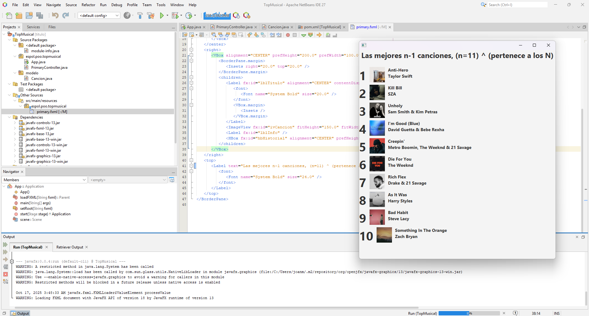
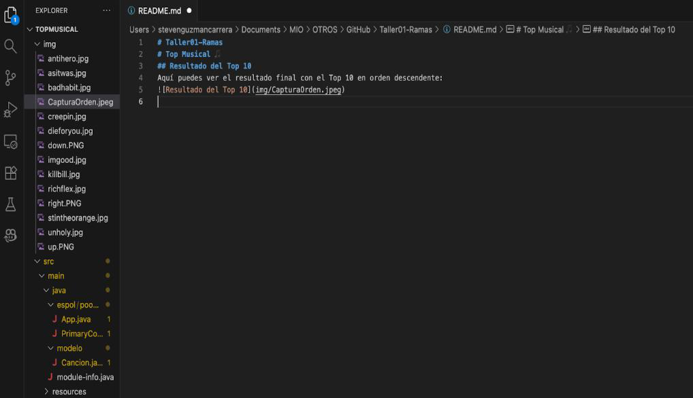
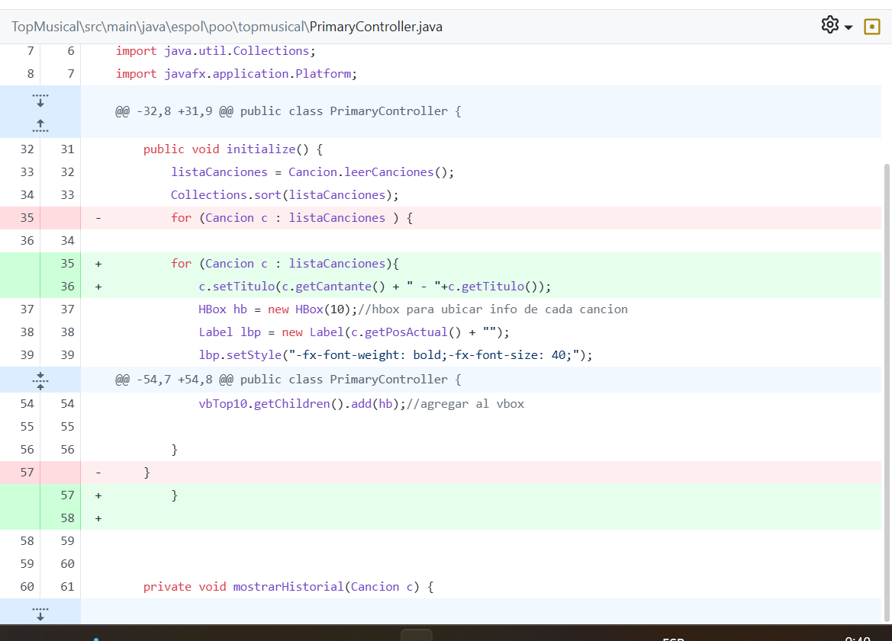
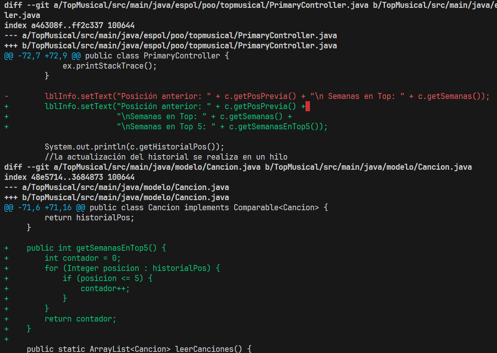

# Taller Git Ramas - Grupo 6
El presente repositorio de GitHub almacena cada instrucción con su respectiva resolución durante las tres sesiones que se plantearon.

## Integrantes:
- Mendoza Rendón Joan Sebastián		(Integrante 1)
- Guzmán Carrera Steven Paúl		(Integrante 2)
- Palacios Pérez Kristel Valeria	(Integrante 3)
- Rincón Hernández Daniel Efraín	(Integrante 4)

## Sección B: Creando Ramas
## Integrante 1: 'Título'

## Integrante 2: 'Orden Descendente'

## Integrante 3: 'Artista'

## Integrante 4: 'Feature Semanas en Top 5'

